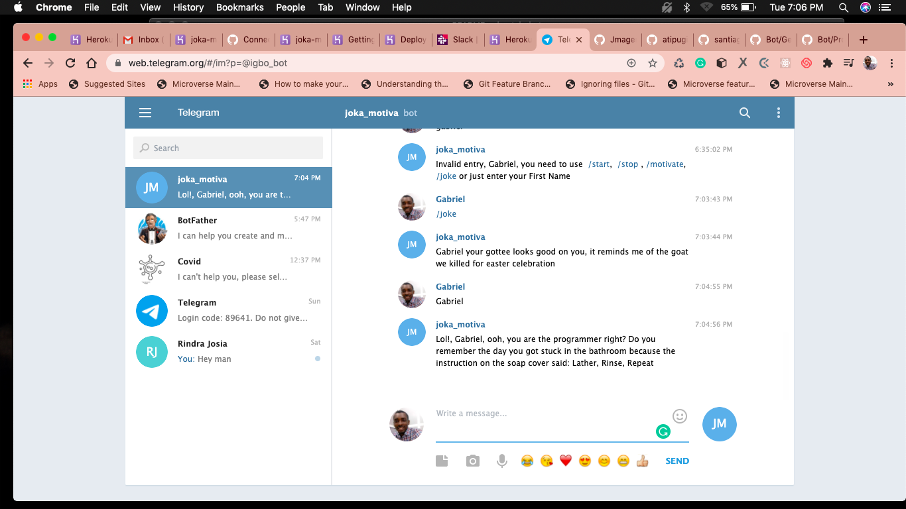

# A SIMPLE TELEGRAM BOT WITH RUBY 

> This is a simplistic bot build on the Telegram Bot API using Ruby

## Built With

- Ruby,
- Rspec,
- Rubocop,
- Telegram-Bot-Ruby

## Live Demo

[Live Demo Link](https://t.me/igbo_bot)

## Getting Started

To get a local copy up and running follow these simple example steps.

### Prerequisites
 * You need to have a personal computer
### Setup
 * You need to clone the repo by running in your Command line : git clone https://github.com/gabrie-lhilarion/tele_bot.git
### Install
 * Change into the 'tele_bot' folder using: cd tele_bot
### Run tests
 * To test the simple classes I made for this app: run rspec 
### Run bot
 * Once in the tele_bot folder run:  ruby bin/main.rb
 * Then open: https://t.me/igbo_bot in your browser
 

👤 **Author**

- Github: [@gabrie-lhilarion](https://github.com/gabrie-lhilarion)
- Twitter: [@gabrielDeman](https://twitter.com/gabrielDeman)
- Linkedin: [@gabrielhilarion](https://linkedin.com/gabrielhilarion)
 
## 🤝 Contributing

Contributions, issues and feature requests are welcome!

Feel free to check the [issues page](issues/).

## Show your support

Give a ⭐️ if you like this project!

## Acknowledgments

- Hat tip to anyone whose code was used
- Inspiration
- etc

## 📝 License

This project is [MIT](lic.url) licensed.
